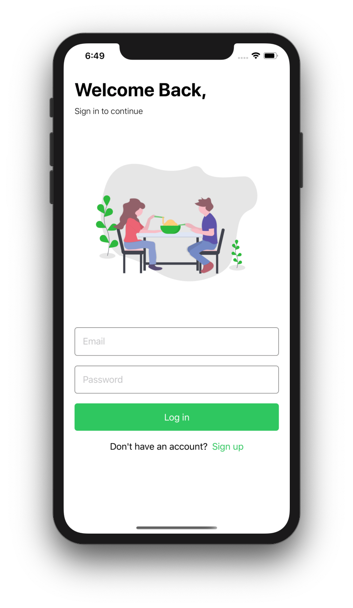
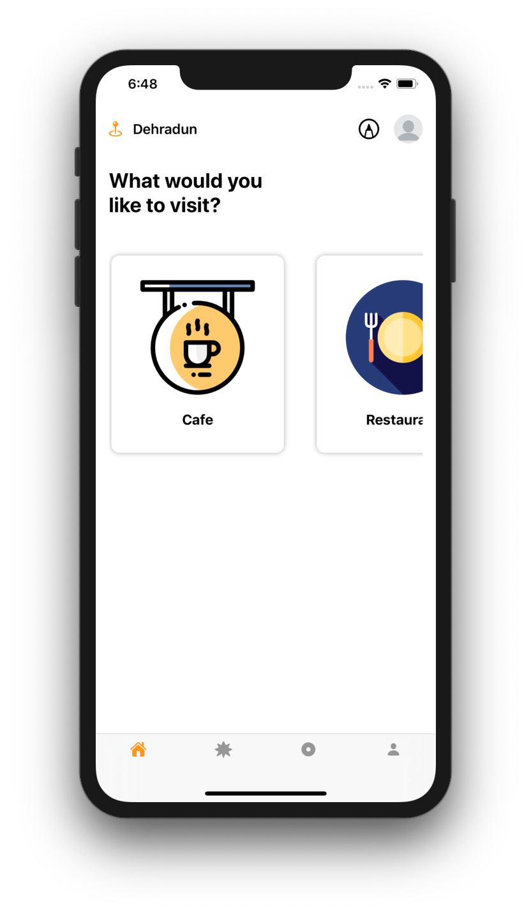
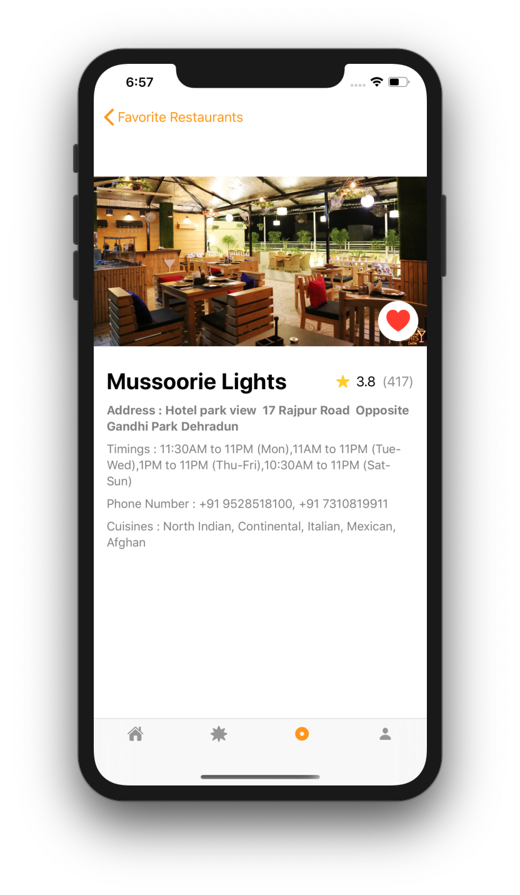
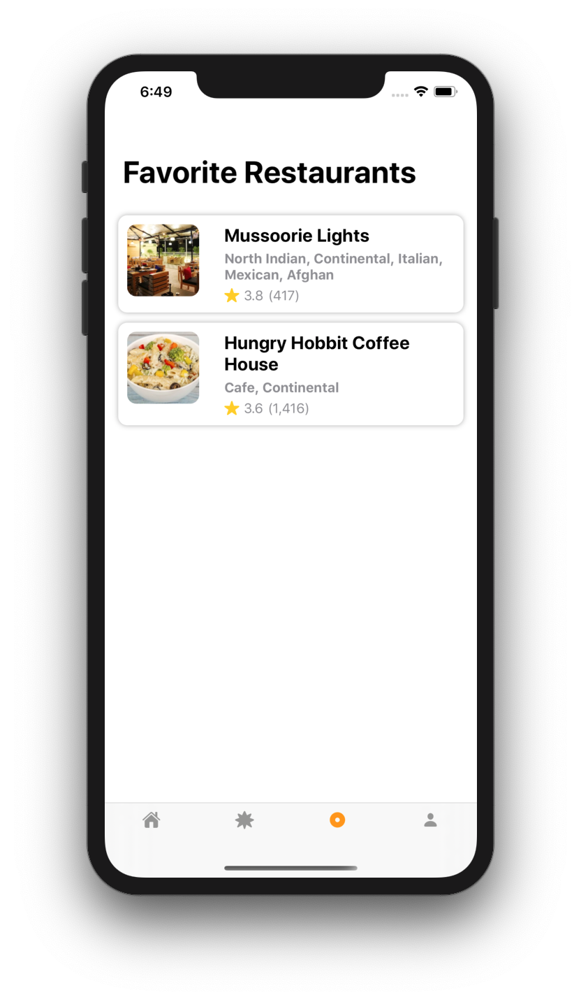
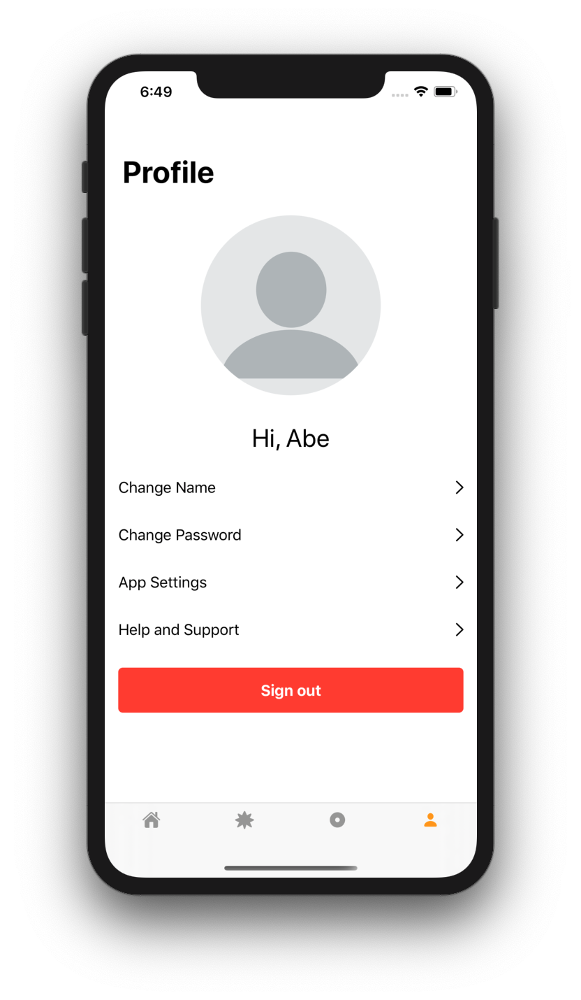

# Restauro

## Screenshot

  
  
  
  
  

## Overview

Restauro is an app which shows Cafes and Restaurant in your City. The user is required to signup into the application before using it. The app uses Firebase as a backend and incorporates Firebase Auth for authentication and Firebase Firestore for data persistence. Browse through the list of all cafes and restaurant in your city and favorite the ones you like. The app incorporates:

- SwiftUI
- Zomato API
- SDWebImageSwiftUI
- Firebase

## Getting Started

> This app is not available on the App Store.

### Prerequisites

- A Mac running macOS
- Xcode

### Installation

1. Clone or download the project to your local machine
2. Open the project in Xcode
3. Run the simulator
